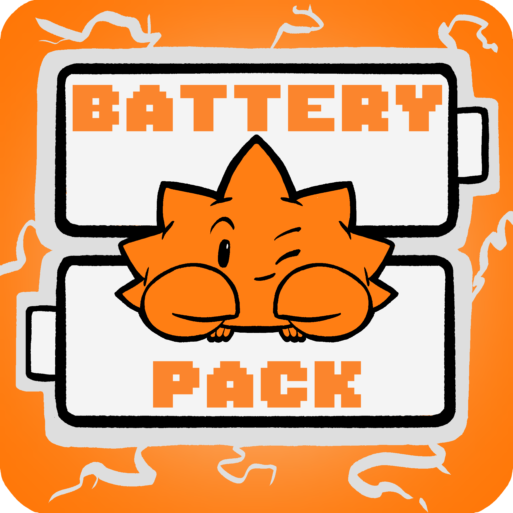

<div style="text-align: center; margin-bottom: 2em;">

</div>

# What is a Battery Pack?

A battery pack is a curated set of crates arranged around a common theme. There's one for [building CLIs](./battery-packs/cli.md), one for [error handling](./battery-packs/error.md), one for [setting up CI](./battery-packs/ci.md), one for [embedded development](./battery-packs/embedded.md), and more. You install `cargo bp` and then:

```bash
cargo bp ls               # search crates.io for available battery packs
cargo bp add cli          # add CLI libraries to your project
cargo bp add embedded     # pick your HAL, concurrency model, peripherals
cargo bp new cli          # scaffold a new project from a template
```

The key ideas:

- **You use the real crates directly.** Battery packs don't wrap or re-export anything. `cargo bp add cli` puts `clap` and `dialoguer` in your `Cargo.toml` — you use their APIs, their docs, their proc macros. A battery pack is just a list of recommendations.
- **Anybody can publish one.** A battery pack is itself a crate on crates.io. If you have opinions about what crates people should use for some domain, you can package those opinions and share them.
- **You're never locked in.** You don't depend on a battery pack at runtime. It's purely a source of truth for `cargo bp` to read. If you don't like one of its choices, swap it out — your code doesn't know the difference.

## What's next

- **[Getting Started](./getting-started.md)** — install the CLI and use your first battery pack
- **[Templates](./templates.md)** — scaffold projects and add CI workflows
- **[Our Battery Packs](./battery-packs/index.md)** — what's available today
- **[Create Your Own](./creating.md)** — publish a battery pack for your domain
